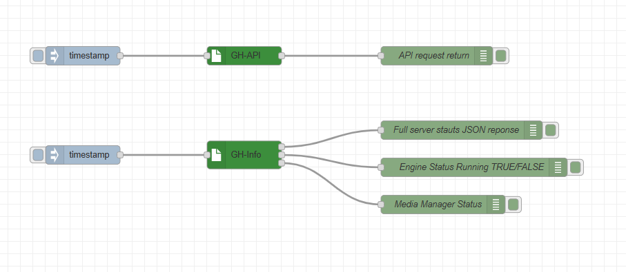

node-red nodes for green hippo api calls

greenhippoAPI -  node for a API call.

greenhippoInfo - node to call engine status and report back full JSON, engine status, media manager status. 

please refer to the following guide for API calls
https://api.tvone.com/products/green-hippo/hippotizer-media-servers/rest_api.html

Example Flow

